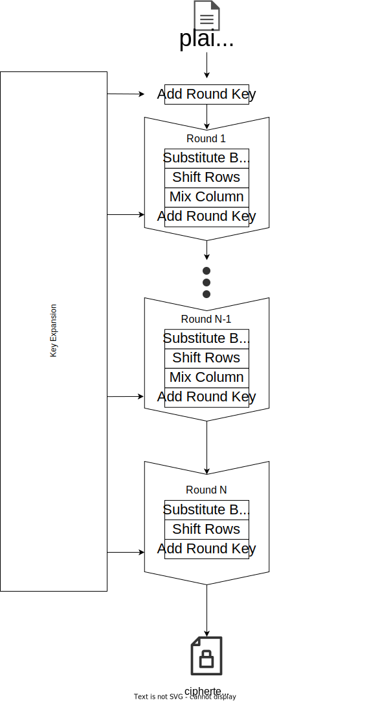
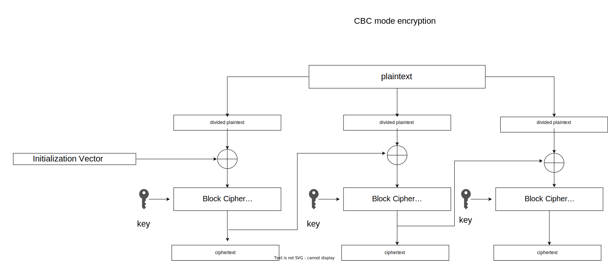

# Symmetric Cryptography

Symmetric ciphers are encryptions algorithms that uses the same key for both encrypting and decrypting data.

Symmetric-key ciphers are of two types:

- **block ciphers** that breaks up the plaintext into multiple fixed-length size blocks and send each block through an encryption function alongside with the secret key.
- **stream ciphers** takes a different approach by encrypting one byte of plaintext at a time

We will focus on block ciphers, specifically on **AES**(Advanced Encryption Standard) which is the most famous symmetric-key cipher.
Many modern processor contain special instruction sets to perform AES operations and you can find more about that in the Hardware Section of SSS.

## How AES works?

AES is basically just a keyed permutation.
In other words it maps every possible input block to another unique output block determined by a key.

AES comes in 3 variants where the key sizes can be 128, 192 or 256 bits and the block size of 128 bits.

In order for AES to perform an keyed permutation that can't be inverted without the key, the algorithm
applies mixing operations on the input.

Because the size of the block is 128 bits (16 bytes), we represent them by a 4x4 matrix of bytes.
In the 128 bits-key AES version there are 10 rounds where the initial 4x4 matrix is modified each round by a number of invertible operations.

Steps of AES Encryption:

- Key Expansion
  - From the 128 bit key we generate 11 separate 128 "round keys" each to be used in **Add Round Key** step
- Initial Add Round Key
  - the bytes of the first round key are XOR'd with the current block matrix
- Round
  - This step is looped 10 times
  - **Substitute Bytes** - each byte of the state is substituted with a different byte according to a lookup table called **S-box**
  - **Shift Rows** - transposition of the last three rows of the block matrix shifted over one, two or
    three columns
  - **Mix Columns** - matrix multiplication is performed on block matrix columns combining the four bytes
    in each column. In the last round this step is skipped
  - **Add Round Key** - the bytes of the current round key are XOR'd with the current block matrix



## Block cipher mode of operation

Block ciphers seems to solve the OTP key size problem but "what if
we want to encrypt more than a block of data?"
We will need to use a block cipher mode of operation.
The mode of operation describes how to securely apply the cipher's
single-block operation to transform data larger than the block
size.

### ECB

ECB stands for Electronic Codebook and is the simplest and not to be used encryption mode.
The way it works it's straightforward: the message is divided into
multiple blocks and each block is encrypted separately.


The main security issue with ECB mode is that encrypting the same
block of plaintext always returns the same block of ciphertext.

From now on we'll be using the Crypto module from the PyCryptoDome package.
You can install it via pip by using the **pip install pycryptodome** command in your Linux terminal.

```python
from Crypto.Cipher import AES
from Crypto.Random import get_random_bytes
from Crypto.Util.Padding import pad

KEY = get_random_bytes(16) #generate a random 16 bytes key

plaintext = b"$ecret_1nformat1on"

cipher = AES.new(KEY, AES.MODE_ECB)
ciphertext = cipher.encrypt(pad(plaintext, 16))

# Encryption
print(f"Key: {KEY}")
print(f"Ciphertext: {ciphertext}")

decrypted_plaintext = cipher.decrypt(ciphertext) # we don't need to specify the key because we are using the
cipher object initialized with the Key
print(f"Plaintext: {decrypted_plaintext}")
```

### CBC

CBC stands for Cipher Block Chaining and it works by XORing each ciphertext block with the previous one.

In order for CBC to be secure and solve the similarity issue of ECB we must use a random sequence of bytes
called **IV** (initialization vector) in the first block XOR operation.



```python
from Crypto.Cipher import AES
from Crypto.Random import get_random_bytes
from Crypto.Util.Padding import pad

KEY = get_random_bytes(16) # generate a random 16 bytes key

plaintext = b"$ecret_1nformat1on"

cipher = AES.new(KEY, AES.MODE_CBC) #
ciphertext = cipher.encrypt(pad(plaintext, AES.block_size))

# Encryption
print(f"Key: {KEY}")
print(f"IV: {cipher.iv}") # The library will create a random IV if not specified when we create the AES
object
print(f"Ciphertext: {ciphertext}")

cipher = AES.new(KEY, AES.MODE_CBC, cipher.iv) # we initialize a new object specifying the IV used in the
encryption

decrypted_plaintext = cipher.decrypt(ciphertext)
print(f"Plaintext: {decrypted_plaintext}")
```
